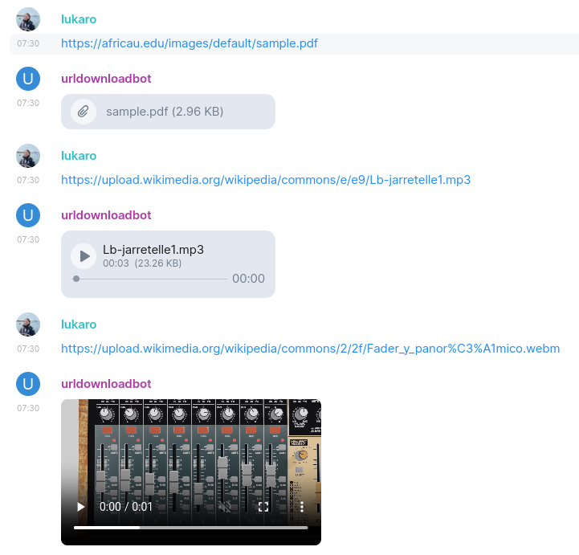
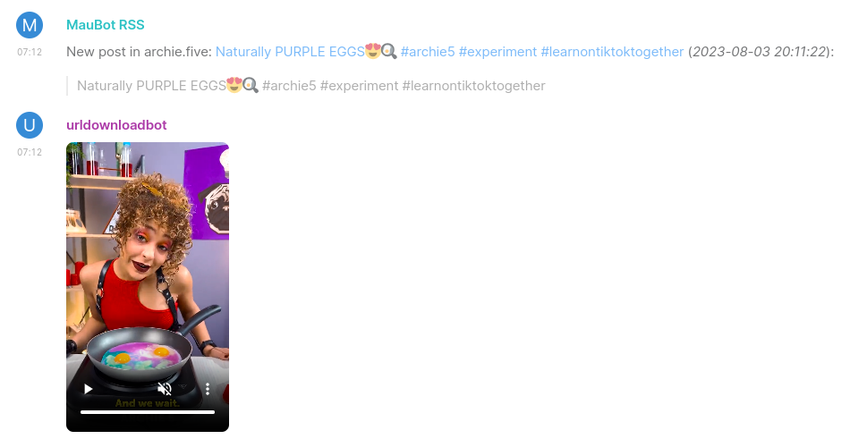

This project fork from [matrix-url-download](https://codeberg.org/LukeLR/matrix-url-download):

# Following extensions:

1. Added the functionality for thread messages, allowing the download of attachments to the thread message list for links within threads.

2. Decides whether to download based on the attachment size limits of the Matrix home server.

3. Asynchronous downloads and timeout requests (maximum of 2 hours).

4. Optimized the default regular expressions to match more URLs and file types.

5. Improved the way links are read, enabling the download of streaming files and more accurate reading of filenames and media types.

   - You can integrate with [cobalt](https://github.com/imputnet/cobalt) (an open-source downloader that provides APIs) to download multimedia from video websites like YouTube, TikTok, Twitter, etc.

6. Replaced the method of reading media metadata (the original project required ffmpeg, which is not supported in the standard maubot image).

7. Optimized code logic, improved the way configurations are read, reduced the possibility of errors, and increased debugging capabilities:

8. Removed the method of reading media metadata (which required packaging ffmpeg in the maubot image) and replaced it with other methods:

   - Image dimensions are now calculated using io.

   - Audio duration is read using the [tinytag](https://pypi.org/project/tinytag/) library.

   - Video dimensions are primarily read from the URL, with a fallback method using [opencv-python](https://pypi.org/project/opencv-python), depending on whether [future maubot](https://docs.mau.fi/maubot/dev/reference/plugin-metadata.html?highlight=modules#plugin-metadata) supports automatic dependency downloads for plugins. Otherwise, you will need to manually import heavy dependency libraries into the plugin directory.

   - Default video dimensions are specified to avoid videos incorrectly occupying the conversation context space on some clients.

   - Thumbnail generation has been removed, as it requires ffmpeg or opencv-python, or obtaining server-generated thumbnail information via the Matrix API after file upload (synapse only supports automatic thumbnail generation for images). This means that previews will only be displayed on the client after the media download is complete.

# matrix-url-download

A plugin for the maubot bot framework implementing URL downloads in matrix rooms.

When added to a room, this bot will scan all messages for URLs. If an URL is encountered, its mime type and file extension is checked against. If mime type or extension match a customizable regex, the linked file is downloaded and posted to the chat.

Matrix message types are implemented, so video / audio messages will be playable in clients that support inline media (like Element), photos will be displayed as photos. Other files are displayed as file attachments.

Configuration is possible for admins using the maubot admin panel and per room using the `!urldownload` bot command (can be adjusted in the settings).

The bot keeps track of attachments that were already posted and reuses the matrix media store URIs on subsequent posts, therefore minimizing storage usage on the matrix server by avoiding duplicate uploads.

## Examples
The following example shows the download of documents and some media in Element:

### Archiving feeds
Another use-case is using this plugin in combination with [Maubot RSS](https://github.com/maubot/rss/tree/master) to automatically download media attached to RSS feeds.

## Installation
1. Create an account for the bot on a matrix homeserver of your choice
2. Install the [maubot bot framework](https://github.com/maubot/maubot/) by following the [official instructions](https://docs.mau.fi/maubot/usage/setup/index.html).
3. Configure an admin user and password in the config file
4. Authenticate the maubot cli against the maubot web api with that user using `mbc login`
5. Clone or download this repository
6. `cd` into this directory (containing `maubot.yaml` amongst others)
7. Execute `mbc build -u` to build and upload this plugin to your maubot serve
8. Follow the steps on [basic usage](https://docs.mau.fi/maubot/usage/basic.html) to create a client and an instance of the plugin 
   1. use `mbc auth` to generate an access token for the matrix account created in step 1
           Note: To generate access tokens using the maubot cli `mbc`. you need to configure your homeserver in the maubot config. Otherwise you can use other means to generate an access token for the matrix bot account.
9. Enjoy!